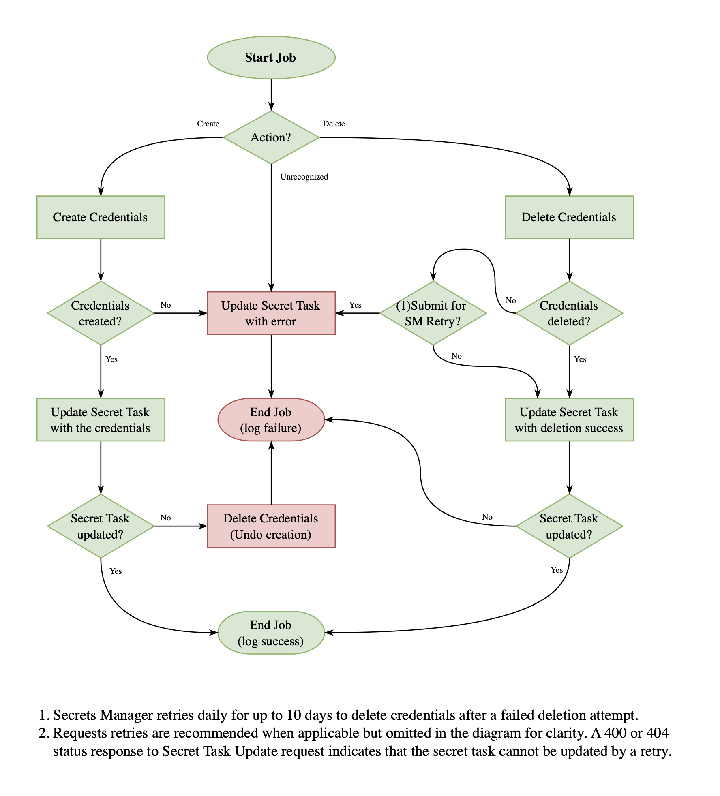

# Getting Started with IBM Cloud Secrets Manager Custom Credentials and Code Engine Jobs

This repository contains:

* Best practices, helper tools and a getting started example for designing and building Code Engine Jobs for generating Secrets Manager Custom Credentials secrets.
* A catalog of credentials providers that can be used with IBM Cloud Secrets Manager service.

## Overview

IBM Cloud Secrets Manager service now supports generating custom credentials. Custom credentials can represent various types of secrets, implemented using a **credentials provider**.

A **credentials provider** is an IBM Cloud Code Engine Job that implements a Secrets Manager interface. It is typically designed to create and delete credentials for a third-party system.

This model enables cloud developers to extend Secrets Manager by supporting additional secret types. Developers can then create and manage these secrets alongside the built-in service secrets, ensuring a uniform lifecycle management experience.

## Designing a new credentials provider Job

When designing a new credentials provider job, begin by defining the configuration for input and output environment variables. These variables define the API contract between your credentials provider and Secrets Manager.

During secret creation and rotation, Secrets Manager validates input and output variables against the credentials provider configuration. The supported environment variable types are:

* `string`
* `integer`
* `boolean`
* `enum`
* `secret_id`

Follow these naming conventions:

* **Input variables:** Use the prefix **SMIN_**, e.g. **SMIN_USERNAME**
* **Output variables:** Use the prefix **SMOUT_**, e.g. **SMOUT_TOKEN**
* **Runtime variables:** When triggering a job run, Secrets Manager sets runtime environment variables in the **SMIN_<VARIABLE_NAME>_VALUE** format, e.g. **SMIN_USERNAME_VALUE**

Refer to the [Secrets Manager custom credentials engine documentation](https://cloud.ibm.com/docs/secrets-manager) for further details.

### Example Job Configuration

Below is an example `job_config.json` defining job environment variables:

```json
{
  "job_env_variables": [
    { "name": "SMIN_USERNAME", "value": "type:string, required:true" },
    { "name": "SMOUT_TOKEN", "value": "type:string, required:true" }
  ]
}
```

For reference, see the example [job_config.json](./example-certificate-provider-go/job_config.json) file.

### Required and non-required variables

Consider which input variables should be tagged as `required:true`, requiring user input when creating a new secret. For optional input variables, define provider default values.

Consider which output variables should be tagged as `required:true`, ensuring they are always included in the credentials returned to Secrets Manager. At least one required output variable must be defined.

Clearly document your credentials provider’s default values to ensure visibility for other users utilizing your credentials provider.

### Accessing Third-Party Systems

When generating credentials for a third-party system, it is recommended to store the login credentials as a secret in Secrets Manager. Configure an input environment variable of type `secret_id`, and in your job code, retrieve the secret using Secrets Manager's API to authenticate with the third-party system.

### Accessing Secrets Manager

The credentials provider job authenticates with Secrets Manager using an IBM Cloud IAM API key. When designing your job, consider the best way to manage this API key. The recommended options are:

* **IAM Credentials Secret (Recommended)**:<br>
  Store the API key as an IAM Credentials secret in Secrets Manager. When configuring the custom credentials engine, Secrets Manager injects the API key into the Code Engine Job as a secret with the key **SM_ACCESS_APIKEY**.
  * This method ensures Secrets Manager automatically rotates the API key and assigns a fresh key for each job run.
  * **Note:** Once a configuration is created with this method, it cannot be updated to use a different authentication method.

* **Trusted Profile**:<br>
  Alternatively, configure a **Trusted Profile** for authentication. Refer to the [IBM Cloud Code Engine documentation](https://cloud.ibm.com/docs/codeengine?topic=codeengine-getting-started&q=trusted+profile&tags=codeengine) for setup details.

### Security Considerations

To enhance security in production environments:

* **Principle of least privilege:**<br>
  Restrict job access to only the necessary secrets by using a dedicated secret group.
* **IAM roles:**<br>
  Assign the API key used by the job to authenticate with Secrets Manager the `SecretTaskUpdater` role. If the job needs to read secrets, also assign the `SecretsReader` role. Both roles should be scoped to the dedicated secret group.
* **Avoiding Personally Identifiable Information (PII)**<br>
  Do not use personal identifiers (e.g., email addresses, social security numbers) as credential IDs. Secrets Manager treats the credential ID as metadata, not sensitive secret data.

## Credentials Provide Job flow

A typical job flow involves implementing the following actions:

* **Create credentials:** Handles the generation of new credentials.
* **Delete credentials:** Manages credential revocation.
* **Update Secret Task:** Sends the result back to Secrets Manager.

Refer to the following job flow diagram for more details:

<br><br>


## Next steps

Learn about the [Credentials Provider tools](./tools/README.md)

Try the [example-certificate-provider](./example-certificate-provider-go/readme.md)